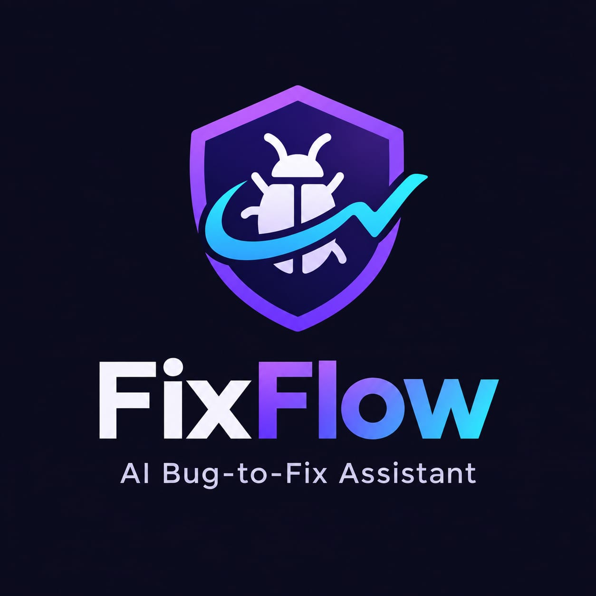
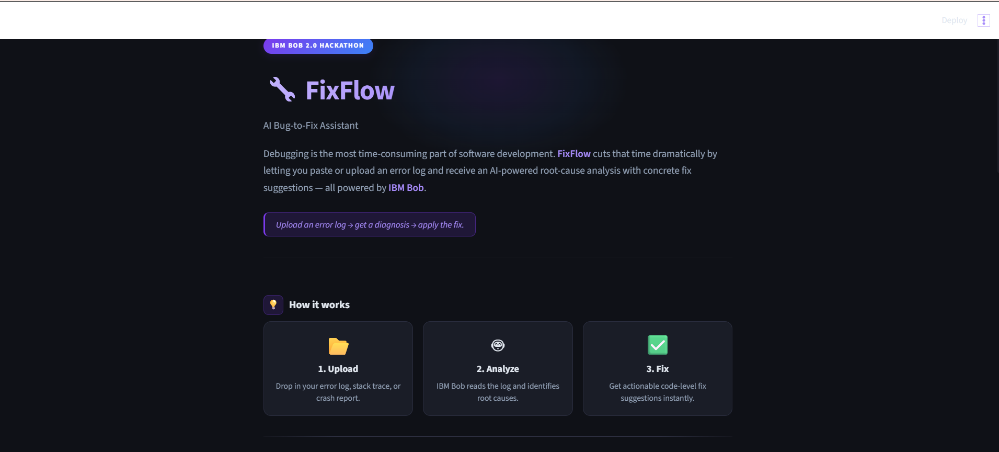
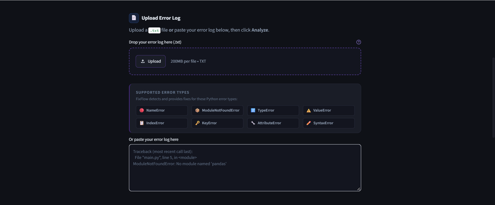
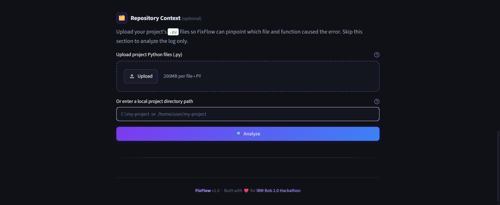

<div align="center">



# 🔧 FixFlow

### AI Bug-to-Fix Assistant

**Built for the IBM Bob 2.0 Hackathon**

[](https://www.python.org/)
[](https://streamlit.io/)
[](https://py-pdf.github.io/fpdf2/)
[](https://www.ibm.com/)
[](LICENSE)

---

*Upload an error log → get a diagnosis → apply the fix.*

</div>

---

## 📌 Problem Statement

Debugging is the most time-consuming part of software development. Developers often lose hours searching Stack Overflow, reading opaque tracebacks, and guessing which file broke — especially under deadline pressure.

**FixFlow** solves this by turning a raw Python error log into a structured, actionable fix report in seconds. It identifies the error type, explains what it means in plain English, pinpoints the exact file and function in your codebase, suggests a numbered fix plan, and exports a professional PDF you can share with your team.

---

## ✨ Features

| # | Feature | Description |
|---|---|---|
| 1 | **Error Detection** | Rule-based regex scanner detects 26 Python exception types instantly |
| 2 | **Plain-English Advice** | Each error comes with an explanation, root cause, step-by-step fix, and an example code snippet |
| 3 | **Repository Context** | Upload your `.py` files — FixFlow matches traceback frames to your actual source, identifies the function, and shows the relevant lines |
| 4 | **PDF Bug Reports** | One-click download of a professional PDF with auto-generated Report ID, severity rating, and all analysis sections |
| 5 | **Severity Classification** | Errors automatically rated High / Medium / Low with colour-coded badges |
| 6 | **Dual Input Mode** | Upload a `.txt` log file **or** paste a traceback directly into the text area |
| 7 | **Local Directory Scan** | Provide a local project path and FixFlow recursively scans every `.py` file |
| 8 | **Dark Theme UI** | Modern dark interface with purple/blue accents, rounded cards, and fully responsive layout |

---

## 🖼️ Screenshots

> **Replace the placeholder paths below with real screenshots once the app is running.**

### Home Page



---

### Analysis Results — Error Card



---

### Repository Context Match



---

### PDF Bug Report


---

## 🛠️ Tech Stack

| Layer | Technology | Purpose |
|---|---|---|
| **Frontend** | [Streamlit](https://streamlit.io/) | Web UI, file uploaders, interactive widgets |
| **Error Detection** | Python `re` (regex) | Pattern-matching against 26 exception types |
| **AST Analysis** | Python `ast` | Walks source files to find the function at a given line |
| **PDF Generation** | [fpdf2](https://py-pdf.github.io/fpdf2/) | Pure-Python, no system font dependencies |
| **AI Integration** | [IBM Bob](https://www.ibm.com/) | Planned AI-powered explanations and fix suggestions |
| **Language** | Python 3.10+ | Type hints, `dataclasses`, `pathlib` |

---

## 📁 Project Structure

```
FixFlow/
│
├── app.py                        # Streamlit entry point — all UI and orchestration
├── requirements.txt              # Runtime dependencies (streamlit, fpdf2)
│
├── analyzer/                     # Core analysis logic — no Streamlit, no I/O
│   ├── __init__.py
│   ├── detector.py               # Regex scanner → DetectedError dataclasses
│   ├── parser.py                 # Public entry point: analyze_log() + parse_uploaded_file()
│   ├── advice.py                 # Rule-based advice DB: explanation, root cause, fix steps, example
│   ├── repo_context.py           # Traceback parser + AST file matcher → ContextMatch dataclasses
│   └── fixer.py                  # Stub: future IBM Bob API integration
│
├── reports/
│   ├── __init__.py
│   └── report_generator.py      # PDF builder: BugReportData → bytes via fpdf2
│
├── assets/                       # Static assets (logo, screenshots)
├── bob_sessions/                 # IBM Bob session data (gitignored)
│
├── AGENTS.md                     # AI assistant guidance for this repo
└── .bob/                         # IBM Bob mode-specific rules
    ├── rules-agent/AGENTS.md
    ├── rules-ask/AGENTS.md
    └── rules-plan/AGENTS.md
```

---

## ⚙️ Installation

### Prerequisites

- Python 3.10 or higher
- pip or [uv](https://github.com/astral-sh/uv) (recommended)

### Steps

```bash
# 1. Clone the repository
git clone https://github.com/<your-org>/fixflow.git
cd fixflow

# 2. Create and activate a virtual environment
python -m venv .venv

# Windows
.venv\Scripts\activate

# macOS / Linux
source .venv/bin/activate

# 3. Install dependencies
pip install -r requirements.txt

# — or with uv —
uv pip install -r requirements.txt

# 4. Run the app
streamlit run app.py
```

The app opens automatically at **http://localhost:8501**.

---

## 🚀 Usage

### Analyze an error log

1. **Upload** a `.txt` file containing a Python traceback, **or** paste the traceback directly into the text area.
2. *(Optional)* **Add Repository Context** — upload your project's `.py` files or enter a local directory path.
3. Click **🔍 Analyze**.
4. Review the results:
   - **Error type** with location in your log
   - **Plain-English explanation** of what went wrong
   - **Root cause** highlighted in amber
   - **Step-by-step fix suggestions** with numbered guidance
   - **Example fix code** with syntax highlighting
   - **Repository context** — matched file, function, line number, and relevant source snippet
5. Click **⬇️ Download Bug Report (.pdf)** to save the full analysis.

### Example input

```
Traceback (most recent call last):
  File "main.py", line 8, in <module>
    result = process(data)
  File "processor.py", line 22, in process
    return transform(value)
ModuleNotFoundError: No module named 'pandas'
```

---

## 🤖 IBM Bob Integration

FixFlow is designed from the ground up to integrate with **IBM Bob**, IBM's AI coding assistant platform.

### Current usage
- The entire project was scaffolded, built, and iterated using IBM Bob 2.0 as the primary coding assistant.
- Bob's agentic capabilities guided architecture decisions, module design, and code quality throughout all milestones.

### Planned integration (`analyzer/fixer.py`)
The `fixer.py` stub is the designated integration point. The planned flow:

```
User uploads log
      │
      ▼
analyzer/detector.py   ← rule-based, already live
      │
      ▼
analyzer/fixer.py      ← IBM Bob API call (planned)
      │  • Send: error type + raw traceback
      │  • Receive: AI-generated explanation + tailored fix
      ▼
reports/report_generator.py  ← same PDF, now with AI content
```

The `get_advice()` function in `analyzer/advice.py` is intentionally the **single replacement point** — swapping the dict lookup for a Bob API call requires changing exactly one function with the same return type.

---

## 👥 Team

| Member | 
-
| **Impana** | 
| **Harshitha G** | 

> Built with ❤️ at the **IBM Bob 2.0 Hackathon**.

---

## 🔮 Future Improvements

| Priority | Feature |
|---|---|
| 🔴 High | **IBM Bob AI explanations** — replace rule-based advice with Bob-powered, context-aware fix suggestions |
| 🔴 High | **Multi-language support** — extend detection beyond Python (JavaScript, Java, Go) |
| 🟠 Medium | **Fix auto-apply** — generate a diff / patch and apply fixes directly to source files |
| 🟠 Medium | **CI/CD integration** — GitHub Action that posts FixFlow analysis as a PR comment on test failures |
| 🟠 Medium | **Session history** — save and revisit past analyses with persistent storage |
| 🟡 Low | **VS Code extension** — run FixFlow analysis from the editor without leaving the IDE |
| 🟡 Low | **Slack / Teams bot** — paste a traceback in chat and get the fix report inline |
| 🟡 Low | **Team dashboard** — aggregate error statistics and trends across a project |

---

## 📄 License

This project is licensed under the **MIT License** — see the [LICENSE](LICENSE) file for details.

---

<div align="center">

**FixFlow v1.0** &nbsp;·&nbsp; IBM Bob 2.0 Hackathon &nbsp;·&nbsp; [IBM Bob](https://www.ibm.com/)

</div>
